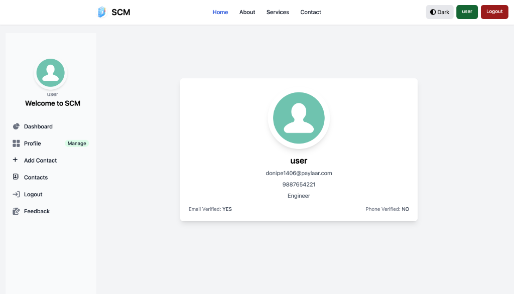
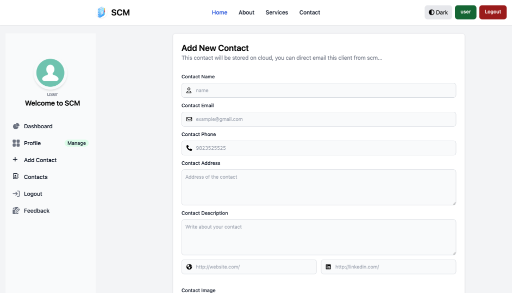

# Smart Contact Manager (SCM)

Smart Contact Manager is a full-stack web application built with **Spring Boot**, **Thymeleaf**, and **PostgreSQL** to help users securely manage their contacts with features like search, pagination, profile images, authentication, and more.

It demonstrates real-world backend development with Spring Security, JPA, server-side rendering, and UI enhancements with Tailwind CSS and Flowbite.

## 📸 Screenshots

### Homepage


### User Profile


### Add Contact


---

## 📌 Features

✔ User signup & login (Spring Security)  
✔ Add, update, delete contacts  
✔ Contact search & pagination  
✔ Profile & contact image support  
✔ Light / Dark theme switch  
✔ Email integration (JavaMailSender)  
✔ Thymeleaf templating & layouts  
✔ Tailwind CSS + Flowbite UI components  

---

## 🛠 Technologies Used

**Backend:** Java 21, Spring Boot 4.x  
**Database:** PostgreSQL  
**Frontend:** Thymeleaf, Tailwind CSS, Flowbite  
**Build:** Maven  
**Email:** Spring Boot Mail (JavaMailSender)  
**Image Support:** Cloudinary (optional)  

---

## 🧾 Prerequisites

Before running locally, make sure you have:

✔ Java 21+  
✔ Maven  
✔ PostgreSQL  
✔ Optional: Gmail app password for email features

---

## 🚀 Setup & Run Locally

### 1️⃣ Clone the repo

```bash
git clone https://github.com/alwaysvikaschoudhary/Smart_Contact_Manager.git
cd Smart_Contact_Manager
